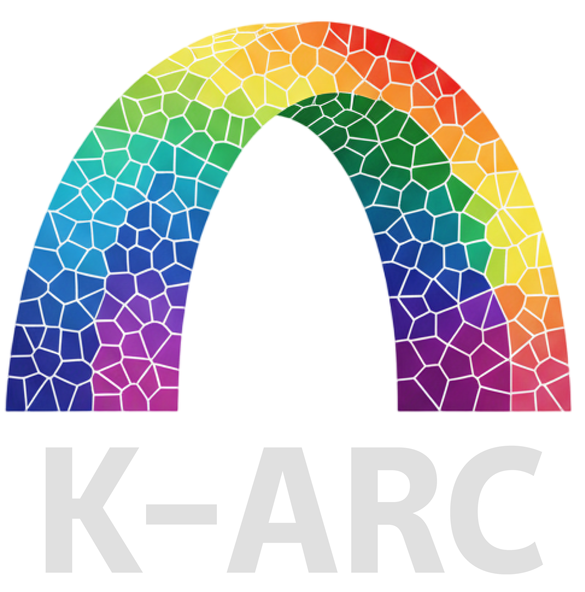

# Korean Autism Research Consortium (K-ARC)

The Korean Autism Research Consortium (K-ARC) is a collaborative initiative led by Dr. Hee Jeong Yoo at Seoul National University Bundang Hospital, bringing together leading researchers to advance autism spectrum disorder research through comprehensive genomic and multi-omics approaches. The consortium includes Dr. Eunjoon Kim (Synaptic Brain Dysfunctions, Institute for Basic Science), who provided early large seed funding for genomic resources. Dr. Joon-Yong An (Korea University) leads genomics analysis of whole-genome sequencing data.

Clinicians Drs. So Hyun (Sophy) Kim (Korea University), Mi Ae Oh (Kyung Hee University), and Jae Hyun Han (Seoul National University Bundang Hospital) conduct clinical and behavioral assessment, Drs. Yong-Seok Lee (Seoul National University), Eunha Kim (Korea University) and Dae-Ki Lee (Ewha Womans University) conduct animal model studies, and Drs. Jae Sang Kim (Ewha Womans University), Woong Sun (Korea University) and Ji Yeon Lee (Seoul National University) conduct organoid research. Additional collaborators include Drs. Ilbin Kim (Gangnam CHA Hospital), Min-Sik Kim (DGIST), Jun Kim (Chungnam National University), Hong-Hee Won (Sungkyunkwan University), Woo-Jae Myung (Seoul National University Bundang Hospital), and Minji Jeon (Korea University) for genomics/multiomics analysis and AI model development.

K-ARC has established one of the largest autism whole-genome sequencing cohorts of East Asian ancestry, with over 1,000 Korean families, enabling discoveries in genetic architecture underlying Korean ASD families. Key publications include comprehensive analysis of sex differences and familial patterns ([Kim et al. 2024, Genome Medicine](https://genomemedicine.biomedcentral.com/articles/10.1186/s13073-024-01385-6)) and within-family analysis demonstrating that de novo protein-truncating variants and missenses in ASD probands show stronger phenotypic effects when accounting for familial background, improving gene discovery and identification of genes with phenotypic heterogeneity ([Kim et al. 2025, Genome Medicine](https://genomemedicine.biomedcentral.com/articles/10.1186/s13073-025-01532-7)). Additional publications include the development of CWAS-Plus for identifying noncoding variant associations ([Kim et al. 2024, Briefings in Bioinformatics](https://academic.oup.com/bib/article/25/4/bbae323/7706421)) and identification of short tandem repeat expansions in East Asian ASD cases ([Kim et al. 2024, Psychiatry and Clinical Neurosciences](https://onlinelibrary.wiley.com/doi/10.1111/pcn.13676)). The consortium continues to expand its large-scale autism genomics cohort and elucidate the genetic architecture in Korean ASD families, with ongoing research utilizing AI technologies to analyze noncoding mutations.

The consortium maintains active international collaborations with Drs. Stephan Sanders (University of Oxford), Donna Werling (University of Wisconsin-Madison), Brett Trost and Stephen Scherer (SickKids Hospital), and Anders D. Børglum and Jakob Grove (iPSYCH, Aarhus University, Denmark).